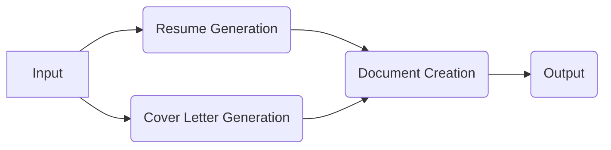

# AIRG-LangGraph

**AI Resume Generator using LangChain and LangGraph**

AIRG-LangGraph is a stateful, multi-actor application that intelligently customizes your existing resume and cover letter for specific job applications using Google's Gemini AI. It leverages LangChain and LangGraph to create a robust, deployable solution for job seekers.

> **Note**: This project uses the latest `google-genai` SDK (the official Google Generative AI Python SDK) for interacting with Google's Gemini models.

## Features

- **Intelligent Document Customization**: Analyzes your existing resume and cover letter to make subtle, targeted improvements based on job descriptions
- **Preserves Document Structure**: Maintains your original document structure and formatting while making targeted content improvements
- **Smart Section Analysis**: Identifies different sections of your documents (summary, experience, skills, etc.) and applies appropriate modifications
- **Recruitment Agency Detection**: Automatically detects if the job is posted by a recruitment agency and adjusts cover letter accordingly
- **PDF Export**: Generates professional PDF documents from the customized DOCX files
- **Stateful Processing**: Leverages LangGraph for maintaining state throughout the document generation process
- **Deployable**: Can be deployed to the LangGraph platform for easy access

## Architecture

The application is structured as a LangGraph agent with the following components:

### Components

1. **Input Node**: Collects user input including document paths, job details, and output preferences
2. **Resume Generation Node**: Uses Gemini (via LangChain) to generate improved resume content
3. **Cover Letter Generation Node**: Uses Gemini (via LangChain) to generate improved cover letter content
4. **Document Creation Node**: Updates DOCX documents with improved content and creates PDFs
5. **Output Node**: Returns paths to the generated files

## Prerequisites

- Python 3.9+
- Google Gemini API key
- Your existing DOCX resume and cover letter

## Installation

See the [SETUP.md](SETUP.md) file for detailed installation and setup instructions.

## Usage

After installation and setup, you can use the application by:

1. Providing your existing DOCX resume and cover letter
2. Running the application with your job details
3. Retrieving the generated DOCX and PDF files from the output directory

## License

This project is licensed under the Apache License 2.0 - see the LICENSE file for details.

## Attribution

Based on the original AIRG project.