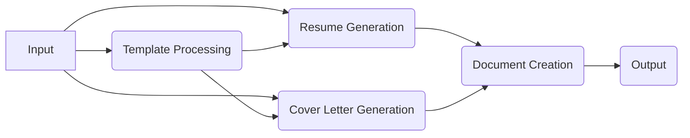

# AIRG-LangGraph

**AI Resume Generator using LangChain and LangGraph**

AIRG-LangGraph is a stateful, multi-actor application that crafts personalized resumes and cover letters using Google's Gemini AI. It leverages LangChain and LangGraph to create a robust, deployable solution for job seekers.

## Features

- **Customized Documents**: Tailors your resume and cover letter based on job description and company details
- **Template-Based Generation**: Uses DOCX templates for consistent formatting and styling
- **PDF Export**: Generates professional PDF documents from the customized DOCX files
- **Stateful Processing**: Leverages LangGraph for maintaining state throughout the document generation process
- **Deployable**: Can be deployed to the LangGraph platform for easy access

## Architecture

The application is structured as a LangGraph agent with the following components:

### Components

1. **Input Node**: Collects user input including template paths, job details, and output preferences
2. **Template Processing Node**: Loads DOCX templates and identifies placeholders
3. **Resume Generation Node**: Uses Gemini (via LangChain) to generate resume content
4. **Cover Letter Generation Node**: Uses Gemini (via LangChain) to generate cover letter content
5. **Document Creation Node**: Updates DOCX templates and creates PDFs
6. **Output Node**: Returns paths to the generated files

## Prerequisites

- Python 3.9+
- Google Gemini API key
- DOCX templates for resume and cover letter

## Installation

See the [SETUP.md](SETUP.md) file for detailed installation and setup instructions.

## Usage

After installation and setup, you can use the application by:

1. Preparing your DOCX templates with placeholders (e.g., `{{JOB_TITLE}}`, `{{COMPANY_NAME}}`)
2. Running the application with your job details
3. Retrieving the generated DOCX and PDF files from the output directory

## License

This project is licensed under the Apache License 2.0 - see the LICENSE file for details.

## Attribution

Based on the original AIRG project.